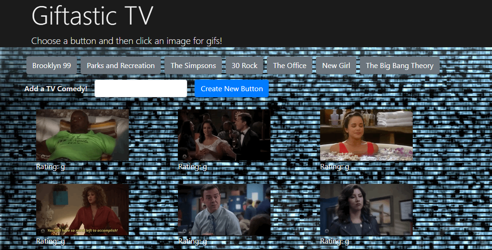

# GifTastic
This web page allows you to pull up the 10 top trending gif related to the topic of your choice via the Giffy API.

### File

[`index.html`](index.html)

### Link

https://lnicholskara.github.io/GifTastic/

### Summary
When the page loads, a few popular TV shows will automatically populate as buttons. To see gifs for the particular program or topic, click on the button to populate 10 gifs, loaded as stills, along with each gif's rating.

To animate the gif, click on the image. To pause the gif, click on the image again.

To add additional buttons to the page, use the form to type in your favorite TV show. Then press enter or submit to add that program as a new button. Once you click on the new button, you can populate 10 gifs about that topic.

### Technologies Used

* HTML
* CSS
* Bootstrap
* Javascript
* jQuery

### APIs Used

* Giffy API
